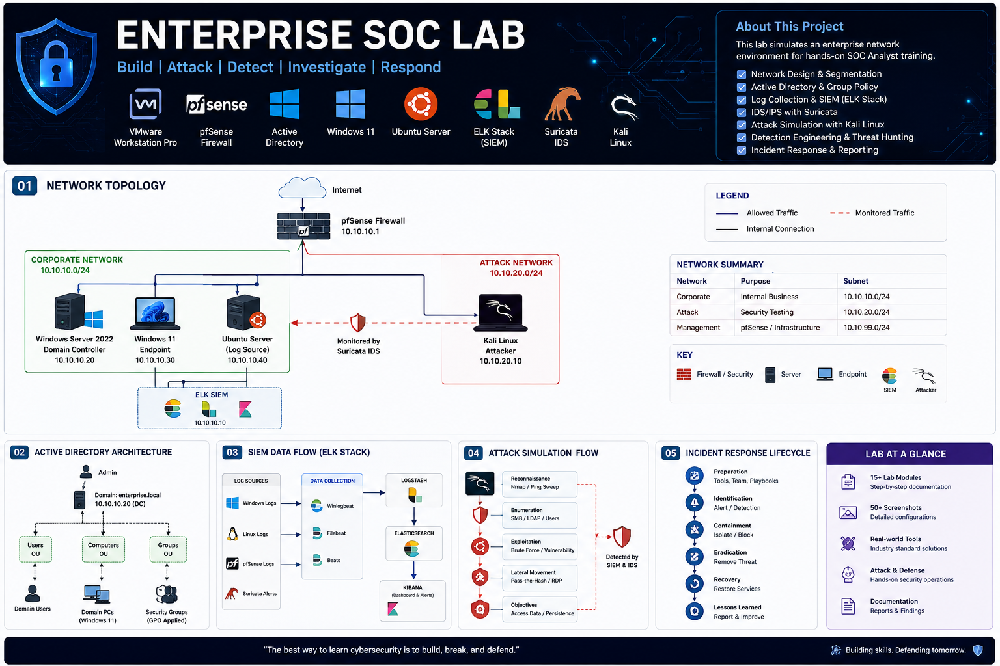

<p align="center">
  
</p>

# Enterprise SOC Lab

Production-style Security Operations Center environment built to simulate enterprise infrastructure, security monitoring, threat detection, and incident response.

---

## Overview

This project documents the design and implementation of a realistic enterprise cybersecurity environment built with VMware Workstation Pro. The lab is designed to provide hands-on experience deploying, securing, monitoring, and defending a Windows-based Active Directory environment using industry-standard technologies.

Each phase of the project is documented from initial planning through infrastructure deployment, security monitoring, attack simulation, and incident response.

---

## Objectives

- Build a segmented enterprise network
- Deploy Windows Server 2022 and Active Directory
- Configure enterprise networking with pfSense
- Centralize Windows and Linux logging
- Deploy Elastic Stack for security monitoring
- Configure Suricata Intrusion Detection System
- Simulate attacks using Kali Linux
- Develop detection rules
- Perform incident response investigations
- Produce professional technical documentation

---

## Lab Architecture

The environment is built around a segmented virtual network consisting of enterprise infrastructure, centralized logging, and an isolated attack network.

A detailed network diagram will be added as the infrastructure is completed.

---

## Technology Stack

| Category | Technologies |
|----------|--------------|
| Virtualization | VMware Workstation Pro |
| Networking | pfSense |
| Operating Systems | Windows Server 2022, Windows 11 Enterprise, Ubuntu Server, Kali Linux |
| Identity | Active Directory, DNS, DHCP, Group Policy |
| Monitoring | Elasticsearch, Kibana, Winlogbeat, Sysmon |
| Detection | Suricata IDS, Sigma Rules |
| Security | MITRE ATT&CK Framework |
| Automation | PowerShell |
| Version Control | Git, GitHub |

---

## Documentation

| Phase | Status |
|---------|--------|
| 00 – Planning | Complete |
| 01 – Infrastructure | In Progress |
| 02 – Identity | Planned |
| 03 – Monitoring | Planned |
| 04 – Detection | Planned |
| 05 – Attack Simulation | Planned |
| 06 – Incident Response | Planned |

Project documentation is organized under the `docs` directory.

---

## Repository Structure

```text
enterprise-soc-lab
│
├── assets
├── configs
├── diagrams
├── docs
├── images
├── reports
├── scripts
├── templates
└── README.md
```

---

## Skills Demonstrated

- Enterprise Infrastructure Deployment
- Windows Server Administration
- Active Directory Administration
- Network Security
- Firewall Configuration
- PowerShell Automation
- SIEM Engineering
- Threat Detection
- Threat Hunting
- Incident Response
- Technical Documentation
- Git Version Control

---

## Project Status

This repository is actively being developed. Documentation and configurations will continue to expand as additional infrastructure and security capabilities are deployed.

---

## License

This project is maintained for educational and professional portfolio purposes.