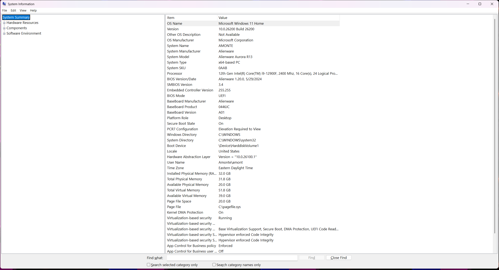
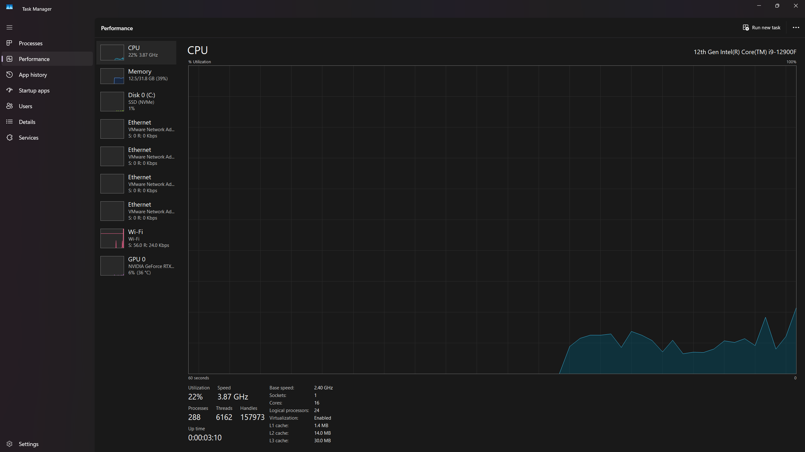

# INF-01 – Host System

> Documents the physical workstation used to build and operate the Enterprise SOC Lab.

| Phase | Document ID | Status |
| :--- | :--- | :--- |
| Infrastructure | INF-01 | Complete |

---

# Overview

The Enterprise SOC Lab is hosted on a dedicated Windows 11 workstation capable of running multiple virtual machines simultaneously using VMware Workstation Pro. The system provides the compute resources required for Active Directory, pfSense, Windows endpoints, Linux servers, and security monitoring infrastructure.

The host serves as the foundation for every component deployed throughout the lab.

---

# Host Specifications

| Component | Value |
| :--- | :--- |
| Manufacturer | Alienware Aurora R13 |
| Operating System | Windows 11 Home |
| Processor | Intel Core i9-12900F |
| Hypervisor | VMware Workstation Pro |
| Virtualization | Intel VT-x Enabled |

---

# Purpose

The host workstation is responsible for:

- Running all virtual machines
- Hosting VMware Workstation Pro
- Providing compute resources for the lab
- Supporting isolated virtual networking
- Serving as the management platform throughout the project

---

> [!TIP]
> A capable host system is critical for virtualization. CPU resources, memory, and hardware virtualization directly impact virtual machine performance and overall lab stability.

---

# Validation

The following items were verified before building the lab:

- Windows 11 installed and fully operational
- Intel VT-x enabled in BIOS
- VMware Workstation Pro installed successfully
- Host system stable under virtualization workload

---

# Screenshots

The following screenshots document the workstation used to build the Enterprise SOC Lab.

| Screenshot | Description |
| :--- | :--- |
|  | Windows System Information displaying the host operating system, processor, BIOS, and hardware configuration. |
|  | Task Manager Performance tab showing available CPU and memory resources used for virtualization. |

---

# Lessons Learned

- Verify hardware virtualization before installing VMware.
- Confirm the host system has sufficient resources before deploying multiple virtual machines.
- Documenting the host platform provides important context for future troubleshooting and project expansion.

---

| Previous | Phase Home | Next |
| :--- | :--- | :--- |
| [Infrastructure README](README.md) | [Infrastructure](README.md) | [02 – VMware Workstation](02-VMware-Workstation.md) |
