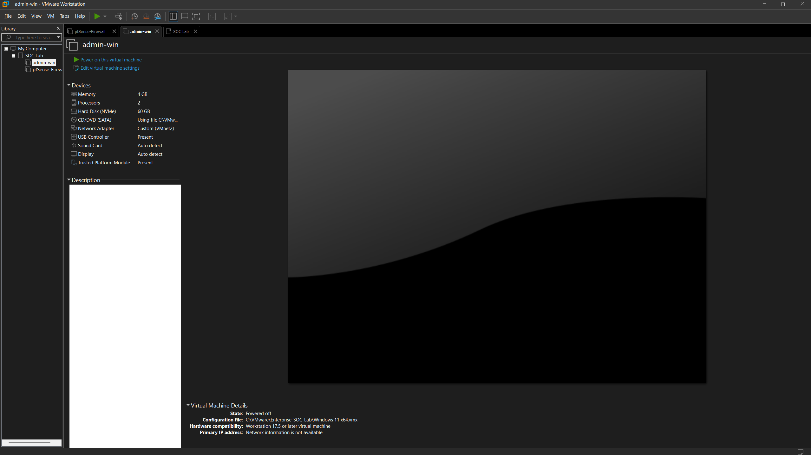
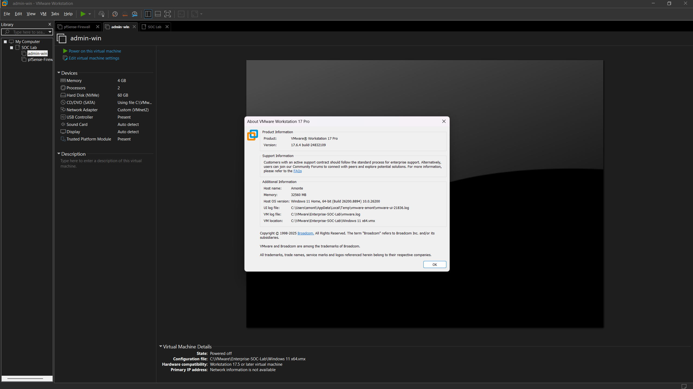
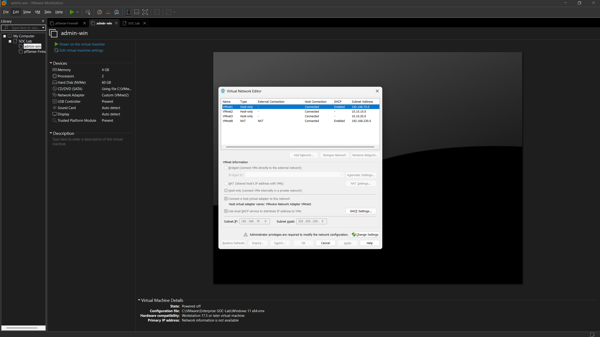

# INF-02 – VMware Workstation

> Documents the installation and configuration of VMware Workstation Pro used to host the Enterprise SOC Lab virtual infrastructure.

| Phase | Document ID | Status |
| :--- | :--- | :--- |
| Infrastructure | INF-02 | Complete |

---

# Overview

VMware Workstation Pro serves as the virtualization platform for the Enterprise SOC Lab. It provides the ability to create, manage, and isolate virtual machines while supporting custom virtual networks required for enterprise security testing.

Every server, workstation, firewall, and attack machine within the lab runs as a VMware virtual machine.

---

# Software Information

| Component | Value |
| :--- | :--- |
| Platform | VMware Workstation Pro |
| Host OS | Windows 11 Home |
| Virtualization | Intel VT-x Enabled |
| Purpose | Enterprise Lab Virtualization |

---

# Responsibilities

VMware Workstation Pro provides the following capabilities:

- Create and manage virtual machines
- Allocate CPU, memory, and storage resources
- Support isolated virtual networking
- Create snapshots before major configuration changes
- Host enterprise infrastructure within a controlled environment

---

> [!TIP]
> ### Standardize Before You Scale
>
> Consistent virtual machine names, organized folders, and validated networking make the environment easier to manage as additional infrastructure is deployed. Small organizational decisions early in the project save significant time later.

---

# Configuration Summary

The VMware environment has been prepared with custom networking to support future deployment of:

- pfSense Firewall
- Windows Server
- Windows 11 Management Workstation
- Ubuntu Server
- ELK SIEM
- Kali Linux Attack Machine

Additional virtual machines will be deployed throughout later phases of the project.

---

# Validation

The following items were verified:

- VMware Workstation Pro installed successfully
- Virtual machine creation confirmed
- Virtual Network Editor accessible
- Custom VMnet networks available for lab deployment

---

# Screenshots

The following screenshots document the VMware environment used throughout the Enterprise SOC Lab.

| Screenshot | Description |
| :--- | :--- |
|  | VMware Workstation Pro home interface showing the current virtual machine inventory. |
|  | Installed VMware Workstation Pro version information. |
|  | Virtual Network Editor configured with custom VMnet networks for the lab environment. |

---

# Lessons Learned

- Configure virtual networking before deploying production lab systems.
- Create a consistent virtual machine naming standard early in the project.
- Validate VMware functionality before building additional infrastructure components.

---

| Previous | Phase Home | Next |
| :--- | :--- | :--- |
| [INF-01 →](INF-01-Host-System.md) | [Infrastructure](README.md) | [INF-03 →](03-Virtual-Networks.md) |
