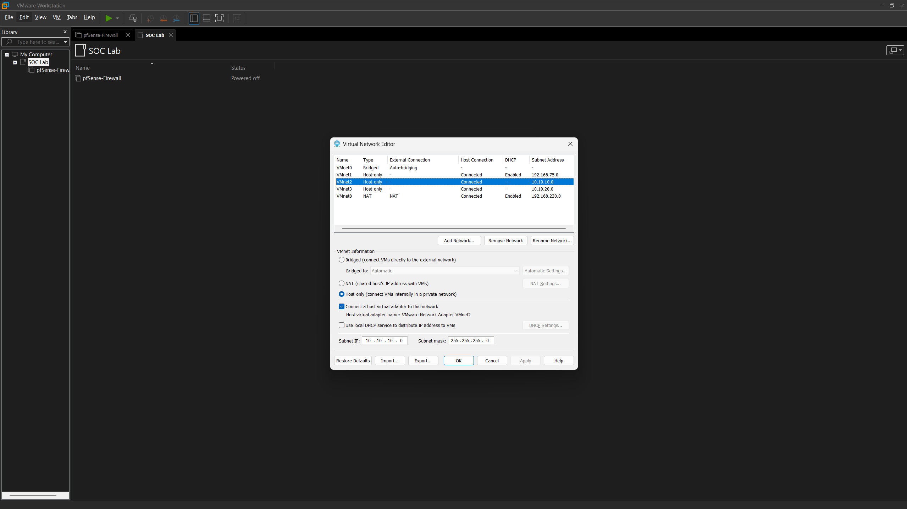
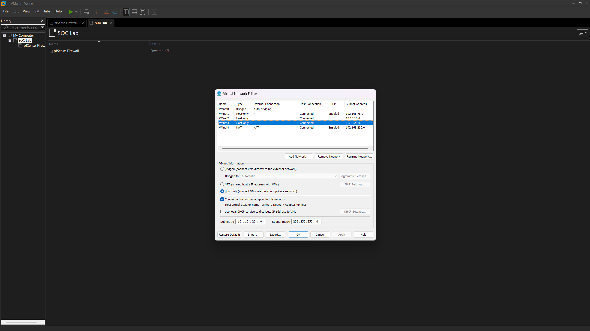

# INF-03 – Virtual Networking

> Documents the virtual network architecture used to isolate systems within the Enterprise SOC Lab.

| Phase | Document ID | Status |
| :--- | :--- | :--- |
| Infrastructure | INF-03 | Complete |

---

# Overview

The Enterprise SOC Lab uses VMware Workstation Pro custom virtual networks to simulate an enterprise environment. Network segmentation allows infrastructure, endpoints, and future attack systems to communicate in a controlled and isolated environment.

The virtual network design provides the foundation for deploying pfSense, Active Directory, Windows clients, Linux servers, and security monitoring tools.

---

# Virtual Networks

| Network | Purpose |
| :--- | :--- |
| VMnet2 | Internal corporate LAN |
| VMnet3 | WAN / External network used by pfSense |

---

# Network Design

Current network layout:

```text
                 Internet
                     │
                 VMnet3 (WAN)
                     │
               +-------------+
               |   pfSense   |
               +-------------+
                     │
                 VMnet2 (LAN)
                     │
      Future Enterprise Infrastructure
```

Future systems connected to the LAN will include:

- Windows Server
- Windows 11 Management Workstation
- Ubuntu Server
- ELK SIEM
- Additional enterprise infrastructure

---

> [!IMPORTANT]
> ### Build One Layer at a Time
>
> Enterprise environments are implemented incrementally. Completing and validating each phase before introducing additional systems creates a stable foundation and makes troubleshooting significantly easier throughout the project.

---

# Configuration Summary

The following custom VMware virtual networks have been created:

- VMnet2 configured for the internal enterprise network
- VMnet3 configured for the external/WAN network
- Networks isolated from each other
- Ready for future virtual machine deployment

---

# Validation

The following items were verified:

- VMnet2 created successfully
- VMnet3 created successfully
- Both virtual networks visible in VMware Virtual Network Editor
- Networks available for virtual machine assignment

---

# Screenshots

The following screenshots document the virtual networking configuration.

| Screenshot | Description |
| :--- | :--- |
|  | VMware Virtual Network Editor showing the VMnet2 internal LAN configuration. |
|  | VMware Virtual Network Editor showing the VMnet3 WAN configuration. |

---

# Lessons Learned

- Design the virtual network before deploying infrastructure.
- Keep WAN and LAN separated to simulate a real enterprise environment.
- A consistent networking design simplifies future deployment and troubleshooting.

---

| Previous | Phase Home | Next |
| :--- | :--- | :--- |
| [INF-02 →](INF-02-VMware-Workstation.md) | [Infrastructure](README.md) | [INF-04 →](04-pfSense-Deployment.md) |
