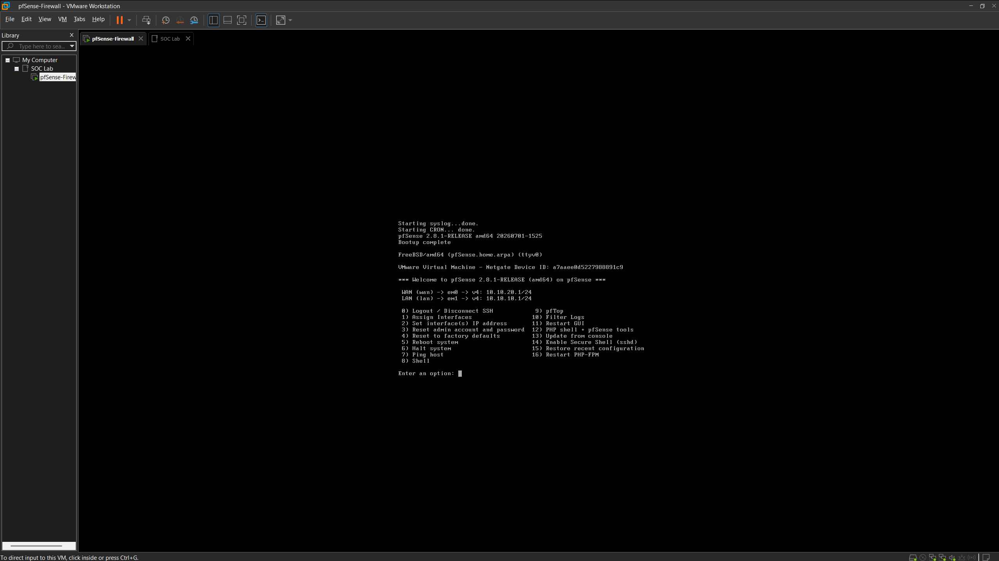

# INF-04 - pfSense Deployment

> Documents the initial deployment of the pfSense virtual firewall for the Enterprise SOC Lab.

| Property | Value |
| :--- | :--- |
| Phase | 01 - Infrastructure |
| Document ID | INF-04 |
| Status | In Progress |

---

# Overview

pfSense serves as the network gateway and firewall for the Enterprise SOC Lab. It will eventually route traffic between the internal enterprise network and the external network while providing firewall, NAT, DHCP, and network security services.

At this stage of the project, the pfSense virtual machine has been successfully installed and booted. Initial configuration has not yet begun.

> [!IMPORTANT]
> This document reflects the current build state of the lab. Additional sections will be added as pfSense is configured in later phases.

---

# Deployment Information

| Component | Details |
| :--- | :--- |
| Appliance | pfSense Community Edition |
| Platform | VMware Workstation Pro |
| Deployment Status | Installed |
| Initial Boot | Successful |
| Configuration Status | Pending |

---

# Purpose

pfSense will provide the following services throughout the Enterprise SOC Lab:

- Enterprise firewall
- Network routing
- Network Address Translation (NAT)
- DHCP services
- Secure communication between network segments

These services will be configured during future infrastructure phases.

---

# Current State

The following tasks have been completed:

- pfSense virtual machine created.
- Installation completed successfully.
- Virtual machine boots normally.
- pfSense console is accessible.
- Console management menu is available.

The following tasks remain:

- Assign interfaces
- Configure LAN and WAN
- Access the WebConfigurator
- Configure firewall rules
- Configure DHCP
- Validate network connectivity

---

# Validation

Deployment was validated by confirming:

- pfSense boots without errors.
- The console menu loads successfully.
- Administrative options are accessible from the console.

---

# Screenshots

| Screenshot | Description |
| :--- | :--- |
|  | pfSense successfully installed and booted to the console management menu. This represents the initial deployment state prior to interface configuration and WebConfigurator access. |

---

# Lessons Learned

Completing the pfSense installation establishes the foundation for the Enterprise SOC Lab's network infrastructure. Future documentation will expand on this deployment as interfaces, routing, firewall policies, and additional network services are configured.

---

| Previous | Phase Home | Next |
| :--- | :---: | ---: |
| INF-03 - Virtual Networks | 01-Infrastructure | INF-05 - Windows Server Deployment |