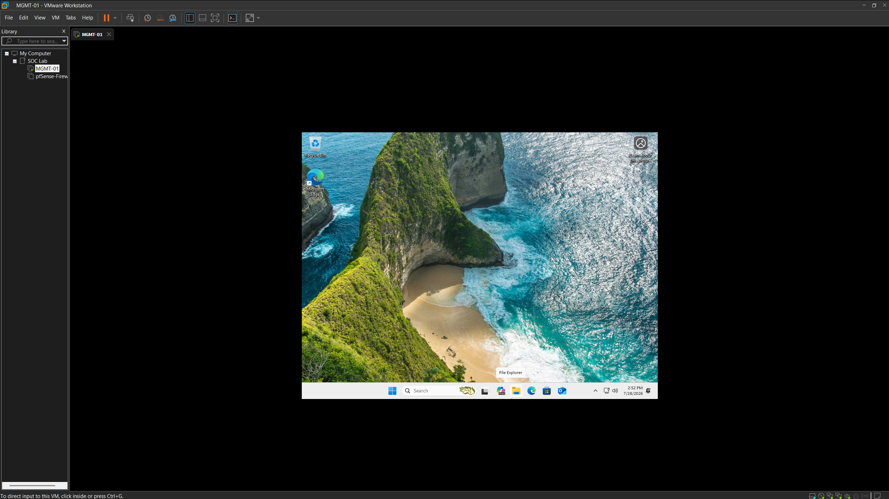
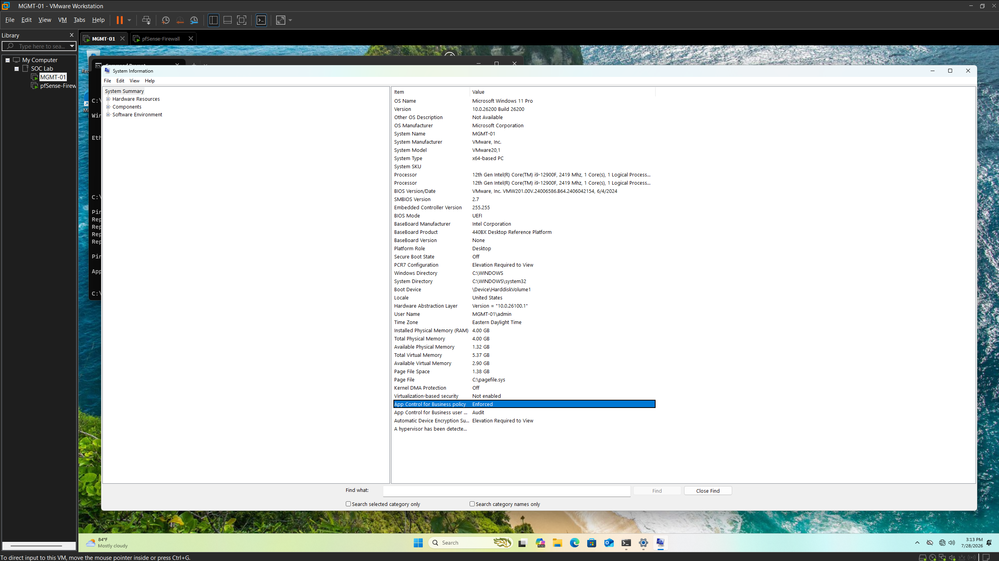

# ID-01 – Management Workstation

> Deploy and configure the Windows 11 management workstation used to administer the Enterprise SOC Lab environment.

| Phase | Document ID | Status |
| :--- | :--- | :--- |
| Identity | ID-01 | Complete |

---

# Overview

The management workstation serves as the primary administrative endpoint for the Enterprise SOC Lab. This system is used to manage infrastructure components, administer Windows systems, access security platforms, and perform daily operational tasks throughout the project.

The workstation was deployed with Windows 11 Pro, connected to the internal corporate network, configured with a static IPv4 address, and validated for connectivity to the pfSense firewall.

> [!IMPORTANT]
> ### Build from a Trusted Administration Endpoint
>
> Enterprise administrators typically perform management tasks from a dedicated workstation instead of directly from servers. Using a consistent administrative endpoint improves security, simplifies management, and provides a centralized location for day-to-day operations.

---

# Objectives

- Deploy Windows 11 Pro
- Install VMware Tools
- Configure a static IPv4 address
- Verify connectivity to the pfSense firewall
- Prepare the workstation for future Active Directory administration

---

# Virtual Machine Configuration

| Setting | Value |
| :--- | :--- |
| Virtual Machine | MGMT-01 |
| Operating System | Windows 11 Pro |
| vCPU | 2 |
| Memory | 4 GB |
| Disk | 80 GB (Thin Provisioned) |
| Network Adapter | VMnet2 |
| Firmware | UEFI |

---

# Network Configuration

| Setting | Value |
| :--- | :--- |
| Hostname | MGMT-01 |
| IPv4 Address | 10.10.10.30 |
| Subnet Mask | 255.255.255.0 |
| Default Gateway | 10.10.10.1 |
| Preferred DNS | 10.10.10.1 |

---

# Configuration Tasks

The following tasks were completed during the workstation deployment:

- Installed Windows 11 Pro
- Installed VMware Tools
- Configured a static IPv4 address
- Verified communication with the pfSense gateway
- Confirmed the workstation is ready for future Active Directory administration

---

# Validation

The workstation deployment was validated by confirming:

- Windows booted successfully
- VMware Tools installed correctly
- Static IP configuration applied successfully
- Successful ICMP communication with the pfSense firewall
- Network settings persisted after reboot

---

# Screenshots

| Screenshot | Description |
| :--- | :--- |
|  | Windows 11 management workstation after initial deployment. |
|  | System information showing the configured workstation. |
|  | Static IPv4 configuration assigned to the workstation. |
|  | Successful connectivity verification to the pfSense gateway. |

---

# Lessons Learned

Preparing a dedicated management workstation before deploying servers creates a more realistic enterprise administration workflow. Completing baseline configuration first allows future infrastructure and identity components to be managed from a centralized administrative system instead of relying on direct virtual machine console access.

| Previous | Phase Home | Next |
| :--- | :--- | :--- |
| [INF-04](../01-Infrastructure/INF-04-pfSense-Deployment.md) | [Identity](README.md) | [ID-02](ID-02-Windows-Server.md) |